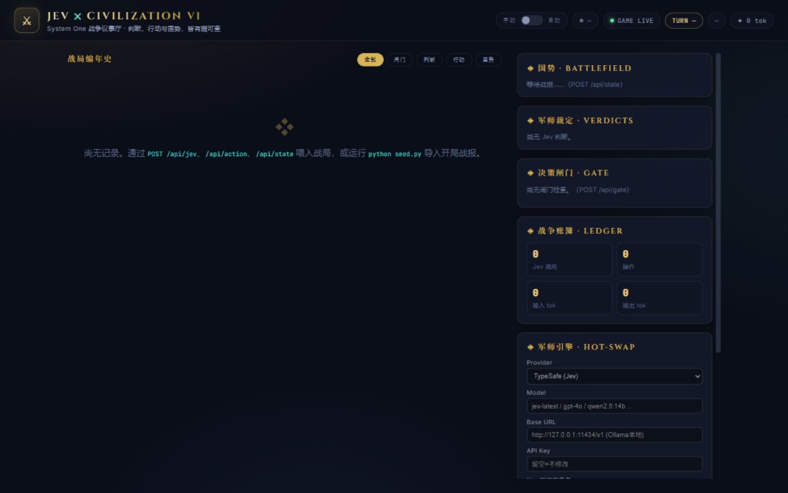
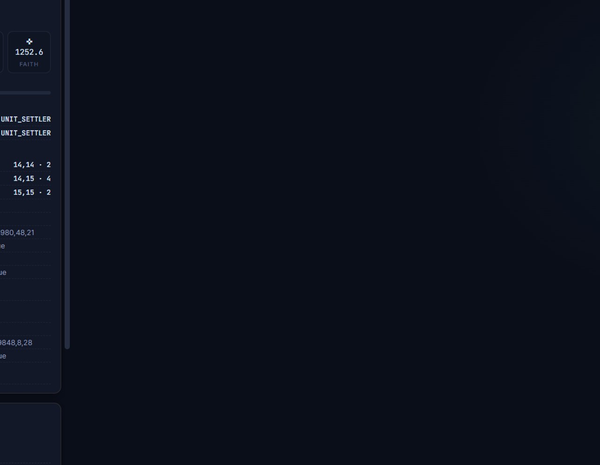

# Jev × Civilization VI · 战争议事厅

**让 LLM 真正玩赢一局文明6**：确定性代码负责"何时问、怎么问、怎么执行"，
LLM（Jev 或任意云端/本地模型）只负责语义判断——研究什么、造什么、打不打、
信不信。每一次判断、每一次操作、每一份国势快照都被记录成可回溯的战争编年史。

**战厅 WebUI**（编年史 · 国势 · 军师热插拔 · 心跳判活）：



**游戏侧**（AI 正在驾驶的文明6 本体）：



---

## 它能做什么

- **全自动打一局文明6**（Gathering Storm 全DLC）：每回合 ~45 秒完成
  采集→判断→执行→推进，**决策管线中位 7.3s**（实测，见下文）
- **14 类回合阻塞全自动解锁**：世界议会、AI交易/求和、外交问答、时代献礼、
  伟人、政策、总督、万神殿、创教、贸易路线、单位晋升、弹窗清扫……
- **五条胜利路线由 LLM 按帝国实况选择**（科学/文化/统治/宗教/外交），
  30 回合重评，可随时手动钦点
- **Web 端热插拔模型**：TypeSafe Jev / OpenAI 兼容（云端或本地 Ollama/
  vLLM）/ Anthropic / 离线 Mock，切换即时生效无需重启
- **代码热重载**：编辑 `server/` 或 `civ6-mcp/src/`，容器内自动生效
- **完整可观测**：SQLite 编年史、决策分阶段计时、线程栈黑匣子、
  心跳指示器、错误自动截图

## 架构

```text
┌────────────────────────────────────────────────────────┐
│                War-Room 容器 :8081（单进程）              │
│  · 决策闸门（纯代码，挡掉无需判断的回合，零 API 成本）      │
│  · LLM 网关（provider 可配置，WebUI 热切换）              │
│  · AutoPilot：监控式循环 + 14 类阻塞解锁 + 防死循环        │
│  · 进程内桥 InProcessBridge（专用事件循环线程）            │
│      └── 复用 civ6-mcp 的 Lua 语料（几百个引擎级操作）      │
│  · SQLite 编年史 + WebUI（心跳/计时/黑匣子）               │
└──────────────┬─────────────────────────▲───────────────┘
        TCP 直连│(host network)           │ typed 判断请求/答案
┌──────────────▼─────────┐   ┌───────────┴──────────────┐
│ 文明6 FireTuner :4318   │   │  LLM 判断层               │
│ (官方 Lua 调试接口)      │   │  jev / gpt / qwen / ollama│
└────────────────────────┘   └──────────────────────────┘
```

**设计哲学**：把"何时问/怎么问/怎么执行"留给确定性代码，只把语义判断交给模型。
实测 Jev 单次判断仅 0.7-1.2s——真正的延迟大头是 Lua 往返次数与引擎忙窗口，
已通过全面批量化 + 沉降探测压到中位 7.3s / 最大 8.5s。

## 快速开始（Docker，一条命令）

```bash
# ── 一次性前置 ────────────────────────────────────────────
# 1. 文明6（Epic/Steam 均可）开启 FireTuner：
#    游戏选项 → 高级 → 启用 FireTuner（会禁用成就），重启游戏生效
# 2. Docker Desktop ≥ 4.34，启用 "Enable host networking"
#    （Settings → Resources → Network；改完重启 Docker Desktop）
# 3. 仓库根目录建 .env 文件（已 gitignore）：
echo "TYPESAFE_API_KEY=你的key" > .env
#    没有也想先跑？把 provider 切成 mock（WebUI 面板一键切换）

# ── 启动 ──────────────────────────────────────────────────
docker compose up -d
# 打开 http://localhost:8081
```

**开机三步曲**：启动游戏 → 打开战厅点 **AUTO**（桥连上主菜单，心跳变绿）→
**再读档/开新局**。顺序不能反——存档加载的瞬间必须有 tuner 客户端在线，
否则游戏的 InGame 上下文永远不会暴露给桥（详见"血泪规则"）。

### 未启用 host networking 的环境

宿主跑 `python scripts/host_forwarder.py`（免管理员 TCP 转发），compose 里
改 `JEVCIV6_GAME_PORT: "14318"` 并去掉 `network_mode: host`。

### 本机运行（不依赖 Docker）

```bash
uv sync                                              # 建 .venv 装齐依赖
copy jevciv6.example.toml jevciv6.toml               # LLM 配置（或默认 typesafe）
uv run uvicorn server.app:app --host 127.0.0.1 --port 8080
```

## 日常使用

| 操作 | 做法 |
|---|---|
| 让 AI 打牌 | 顶栏点 **AUTO**；手动接管点回 **手动** |
| 判断是否真卡 | 看顶栏**心跳徽章**（活跃 <60s 绿 / <180s 黄 / 超时红） |
| 换模型 | 右栏"军师引擎"面板选 provider/模型 → 热替换（本地 Ollama 填 `http://127.0.0.1:11434/v1`）→ 测连通 |
| 改代码 | 直接编辑 `server/` 或 `civ6-mcp/src/`，容器自动热重载（编年史/状态留在宿主不受影响） |
| 钦点胜利路线 | 编辑 `autopilot_state.json` 的 `strategy.path`，保存任意源码文件触发热重载后重新 AUTO |
| 看决策明细 | 编年史按类型筛选（判断/操作/闸门/快照）；`cycle_timing` 事件含每阶段耗时 |

## ⚠️ 血泪规则（真实事故沉淀，违反必卡死）

1. **读档前桥必须在线**：Civ6 只在存档加载瞬间把 InGame/GameCore 上下文
   注册给 tuner，且要求那一刻有客户端连着。顺序：开战厅 AUTO → 再读档。
   验证工具：`scripts/tuner_keeper.py`。
2. **tuner 客户端配额会被死连接耗尽**：游戏侧不回收半死连接，堆满后新连接
   直接被拒（端口明明 LISTEN）。唯一解法是重启游戏；别让任何东西反复
   spawn/杀客户端。
3. **一个进程独占 tuner**：别同时跑两个 war-room。
4. 崩溃恢复顺序：重启游戏 → 战厅 AUTO（主菜单连上）→ 读档 → 自动恢复。

## 决策管线与延迟（实测）

```text
回合翻转 → 沉降探测(等引擎空闲) → 批量采集(2次Lua往返) → 闸门(纯代码,0ms)
   → Jev 判断(0.7-1.2s, 多题合一调用) → 批量执行(订单/单位合并写入) → 推进
```

| 阶段 | 中位耗时 | 优化手段 |
|---|---|---|
| 采集 | 0.8-3.1s | 晋升/生产/万神殿探针全部并入批量 Lua；双腿合并 |
| 判断 | 0.7-1.0s | 多题合一调用；闸门挡掉无决策回合 |
| 反射 | 0-2s | 定性反射（传教/定居/贸易）不调 LLM |
| 执行 | 0.6-3.4s | 研究+市政/宗教单位动作合并单次写入 |
| **整周期** | **7.3s** | 沉降探测×2 + 游戏快速模式 |

## 仓库结构

```text
server/            战争议事厅（决策闸门/autopilot/进程内桥/LLM网关/WebUI）
civ6-mcp/          桥的库本体：FireTuner 协议 + 几百个引擎级 Lua 操作
                   （fork 自 lmwilki/civ6-mcp v1.1.11，大量本地改造）
web/               战厅前端（编年史/国势/热插拔面板/心跳）
scripts/           tuner_keeper(注册验证) / host_forwarder(免管理员转发)
                   game_screenshot(截图) 等
tests/             73 + 99 项单测（无需游戏与网络）
```

## 测试

```bash
uv run python -m pytest tests/ -q          # war-room: 73 tests
cd civ6-mcp && uv run pytest tests/ -q     # bridge:  99 tests
uv run python scripts/dry_run_demo.py      # 离线端到端演示
```

## 已知边界

- FireTuner 会禁用成就；本项目用于单机自动化研究/观赏
- 间谍操作、焚城选择等长尾场景未自动化（不阻塞回合）
- 采集 InGame 腿仍双峰（0.4s/2.4s，游戏 Lua 沙箱的 os.clock 为哑，归因受阻）

## 致谢

- **[lmwilki/civ6-mcp](https://github.com/lmwilki/civ6-mcp)**——桥的原始上游
  （v1.1.11）：FireTuner 协议实现与大量引擎 API 逆向，本项目在其之上做了
  进程内化、批量化、外交/议会/万神殿等大量改造。
- TypeSafe 的 Jev（System One）判断模型。

## 免责声明

本项目通过 Firaxis 官方的 FireTuner 调试接口与游戏交互，仅用于单机环境下
的 AI 研究与自动化演示；不修改游戏内存、不影响多人/排位，请遵守游戏服务条款。
